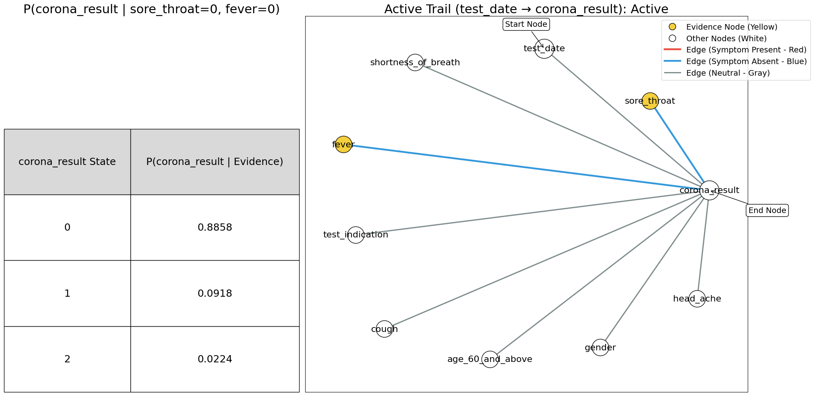
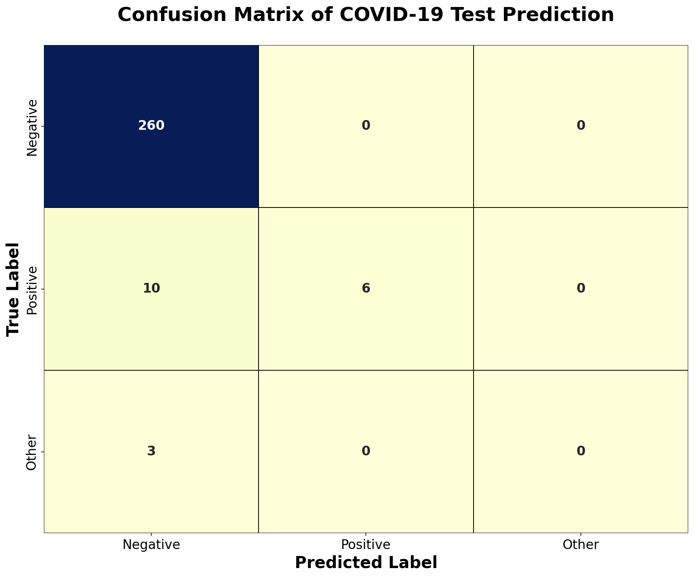
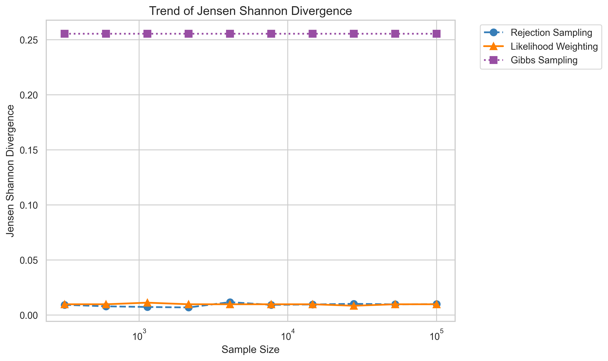

# COVID-19 Bayesian Network Diagnostic Model

## Overview
This repository contains the implementation of an optimized Bayesian Network for COVID-19 diagnosis leveraging Dirichlet priors and BDeu scoring for accurate inference. The model achieves over 94% accuracy in predicting COVID-19 test outcomes based on clinical symptoms and demographic information.

## Features
- **Bayesian Network Construction**: Directed Acyclic Graph (DAG) modeling symptom-disease relationships
- **Advanced Parameter Estimation**: Integration of Dirichlet priors with BDeu scoring metric
- **Multiple Inference Methods**: Implementation and comparison of Likelihood Weighting, Rejection Sampling, and Gibbs Sampling
- **Comprehensive Evaluation**: Multiple distance metrics and performance assessments
- **Clinical Decision Support**: Probabilistic inference for COVID-19 diagnosis

## File Structure

```bash
covid-19-bayesian-network/
├── covid(thirdpaper).ipynb      # Jupyter Notebook with all analysis and code
├── data/
│   ├── corona_tested_individuals_ver_0083.english.csv
│   └── corona_tested_individuals_ver_006.english.csv
└── README.md
```
## 🖥️ Computing Infrastructure and Implementation Details

## 💻 Computing Infrastructure

All experiments were conducted on a computing environment with the following specifications:

## 🔧 Hardware Configuration
- **Processor:** Intel(R) Core(TM) i7-8550U CPU @ 1.80GHz (Turbo up to 1.99 GHz, 4 cores / 8 threads)  
- **Memory:** 20.0 GB RAM (19.9 GB usable)  
- **Storage:** 1TB SSD (used for data processing and model storage)  
- **System Type:** 64-bit Operating System, x64-based processor  

## 🧑‍💻 Software Environment
- **Operating System:** Windows 10 (64-bit)  
- **Python Version:** 3.8.10  

## Requirements
- Python 3.7.15
- pgmpy 0.1.12
- NumPy 1.21.6
- Pandas 1.3.5
- Matplotlib 3.5.3
- Seaborn 0.12.1
- Scikit-learn 1.0.2
- SciPy 1.7.3
- NetworkX 2.6.3
- Statsmodels 0.13.5


## 🛠️ Development Environment

- **Interactive Analysis:** Jupyter Notebook 6.4.3  
- **Version Control:** Git 2.25.1  
- **Package Management:** Anaconda 4.10.3  

---
## Installation

### Step a: Clone the Repository
```bash
git clone https://github.com/username/COVID-19-Bayesian-Network-Diagnostic-Model.git
cd COVID-19-Bayesian-Network-Diagnostic-Model
```

### Step b: Create Conda Environment
```bash
# Using the provided environment file
conda env create -f thirdpaper_covid.yml
conda activate thirdpaper
```

**Alternative Manual Installation:**
```bash
conda create -n thirdpaper python=3.7.15
conda activate thirdpaper
pip install -r requirements.txt
```


##  1. Data Preprocessing
```python
# Handle missing values
df_test['age_60_and_above'].fillna('No', inplace=True)
updated_df['age_60_and_above'].fillna('No', inplace=True)

# Define categorical encodings
cleanup_nums = {
    "corona_result": {
        "other": 2,
        "negative": 0,
        "positive": 1
    },
    "age_60_and_above": {
        "Yes": 1,
        "No": 0
    },
    "gender": {
        "male": 1,
        "female": 0
    },
    "test_indication": {
        "Contact with confirmed": 1,
        "Abroad": 2,
        "Other": 3
    }
}

# Apply encodings
updated_df1 = updated_df.replace(cleanup_nums)
df_test = df_test.replace(cleanup_nums)
```
## 2. Bayesian Network for Corona Diagnosis - Theoretical Description

This implementation creates a probabilistic graphical model using a Bayesian Network to predict corona test results based on various symptoms and demographic factors. The network models the conditional dependencies between symptoms, patient characteristics, and test outcomes.

### Step-by-Step Theoretical Process

### a. Network Architecture Definition

The Bayesian Network structure is defined through a directed acyclic graph (DAG) where edges represent causal or correlational relationships:

```python
architecture = [
    ("test_date", "corona_result"),
    ("cough", "corona_result"),
    ("fever", "corona_result"),
    ("sore_throat", "corona_result"),
    ("shortness_of_breath", "corona_result"),
    ("head_ache", "corona_result"),
    ("age_60_and_above", "corona_result"),
    ("test_indication", "corona_result"),
    ("gender", "corona_result")
]
```


- Each tuple `(parent, child)` represents a directed edge in the graph
- All variables point to `corona_result`, creating a "naive Bayes" structure
- This assumes conditional independence between symptoms given the test result
- The structure encodes domain knowledge about factors influencing corona diagnosis

### b. Model Initialization

```python
model = BayesianModel(architecture)
```


- Creates the graph structure without probability distributions
- Establishes the conditional independence assumptions
- Prepares the framework for parameter learning

### c. Parameter Learning with Bayesian Estimation

```python
model.fit(
    data=updated_df1,
    estimator=BayesianEstimator,
    prior_type="BDeu",
    equivalent_sample_size=10,
    complete_samples_only=False
)
```


#### Bayesian Estimator
- Uses Bayesian parameter estimation instead of maximum likelihood
- Incorporates prior knowledge to handle sparse data scenarios
- Provides more robust estimates when training data is limited

#### BDeu Prior (Bayesian Dirichlet equivalent uniform)
- **Purpose:** Provides uninformative prior distributions for multinomial parameters
- **Theory:** Assumes uniform prior over all possible network structures
- **Advantage:** Works well with sparse data and prevents overfitting
- **Mathematical Foundation:** Uses Dirichlet distribution as conjugate prior for multinomial likelihood

#### Equivalent Sample Size (ESS = 10)
- **Concept:** Controls the balance between prior knowledge and observed data
- **Effect:** Higher values give more weight to prior, lower values trust data more
- **Choice of 10:** Moderate influence, suitable for datasets with reasonable sample sizes
- **Mathematical Interpretation:** Equivalent to having 10 "virtual" samples supporting the prior

#### Incomplete Data Handling
- `complete_samples_only=False` allows learning from partially observed data
- Uses available information even when some variables are missing
- Important for real-world medical datasets with missing values

### d. Model Validation

```python
print(f'Check model: {model.check_model()}')
```

**Validation Process:**
- Verifies the network is a valid DAG (no cycles)
- Checks that all CPDs are properly normalized
- Ensures conditional probability tables are consistent
- Confirms the model satisfies Bayesian network axioms

### e. Conditional Probability Distribution Analysis

```python
for cpd in model.get_cpds():
    print(f'CPT of {cpd.variable}:')
    print(cpd, '\n')
```


- **CPDs (Conditional Probability Distributions):** Core components encoding probabilistic relationships
- **Root nodes:** Have marginal probability distributions P(X)
- **Child nodes:** Have conditional distributions P(Y|Parents(Y))
- **Interpretation:** Each table shows how parent variables influence the child variable

### f. Inference Engine Setup

The implementation provides three different inference methods:

#### Exact Inference - Variable Elimination
```python
inference = VariableElimination(model)
```


- **Algorithm:** Systematically eliminates variables through marginalization and factorization
- **Guarantee:** Provides exact posterior probabilities
- **Complexity:** Exponential in treewidth of the graph
- **Use Case:** When exact answers are required and network size is manageable

#### Approximate Inference - Bayesian Model Sampling
```python
BMS_inference = BayesianModelSampling(model)
```

**Methods Included:**
- **Likelihood Weighting:** Forward sampling with evidence weighting
- **Rejection Sampling:** Generate samples and reject those inconsistent with evidence
- **Theory:** Monte Carlo methods that approximate true posterior distributions
- **Advantage:** Scales better to larger networks than exact inference

#### Approximate Inference - Gibbs Sampling
```python
GS_inference = GibbsSampling(model)
```


- **Algorithm:** Markov Chain Monte Carlo (MCMC) method
- **Process:** Iteratively samples each variable conditioned on all others
- **Convergence:** Eventually samples from true posterior distribution
- **Advantage:** Effective for complex networks with many variables


### Joint Probability Factorization
Given the network structure, the joint probability factors as:

P(test_date, cough, fever, ..., corona_result) = 
P(corona_result | test_date, cough, fever, sore_throat, shortness_of_breath, head_ache, age_60_and_above, test_indication, gender) ×
P(test_date) × P(cough) × P(fever) × ... × P(gender)

### Conditional Independence Assumptions
The naive Bayes structure assumes:
- P(symptom_i | corona_result, symptom_j) = P(symptom_i | corona_result) for i ≠ j
- Symptoms are conditionally independent given the corona result

### Bayesian Parameter Update
For each CPD parameter θ:
- Prior: θ ~ Dirichlet(α)
- Likelihood: Data ~ Multinomial(θ)
- Posterior: θ|Data ~ Dirichlet(α + counts)

### Applications and Use Cases

1. **Diagnostic Support:** Estimate probability of positive corona test given symptoms
2. **Risk Assessment:** Identify high-risk patient profiles
3. **Sensitivity Analysis:** Understand which symptoms are most predictive
4. **Missing Data Handling:** Make predictions even with incomplete patient information
5. **Decision Support:** Provide probabilistic reasoning for medical decisions

### Advantages of This Approach

- **Probabilistic Reasoning:** Provides uncertainty quantification, not just point predictions
- **Interpretability:** Clear causal structure and interpretable probability tables
- **Robust to Missing Data:** Can handle incomplete patient records
- **Prior Knowledge Integration:** Incorporates domain expertise through Bayesian estimation
- **Multiple Inference Options:** Flexibility to choose between exact and approximate methods based on computational constraints
- 
###  Build Bayesian Network
```python
from pgmpy.models import BayesianModel
from pgmpy.estimators import BayesianEstimator
from pgmpy.inference import VariableElimination, BayesianModelSampling, GibbsSampling
from IPython.core.display import display, HTML

# Define the structure of the Bayesian Network
# Each tuple represents a directed edge: (parent, child)
architecture = [
    ("test_date", "corona_result"),
    ("cough", "corona_result"),
    ("fever", "corona_result"),
    ("sore_throat", "corona_result"),
    ("shortness_of_breath", "corona_result"),
    ("head_ache", "corona_result"),
    ("age_60_and_above", "corona_result"),
    ("test_indication", "corona_result"),
    ("gender", "corona_result")
]

# Initialize the Bayesian Model with the given structure
model = BayesianModel(architecture)

# Improve notebook display: prevent line wrapping in output cells (optional)
display(HTML("<style>.output_area pre {white-space: pre;}</style>"))

# Fit the model to the dataset using a Bayesian Estimator
# - BDeu prior: suitable for sparse data
# - Equivalent Sample Size controls the influence of prior vs. data
# - complete_samples_only=False allows incomplete rows in the training data
model.fit(
    data=updated_df1,
    estimator=BayesianEstimator,
    prior_type="BDeu",
    equivalent_sample_size=10,
    complete_samples_only=False
)

# Validate the model to ensure there are no logical inconsistencies
print(f'Check model: {model.check_model()}\n')

# Print the Conditional Probability Distributions (CPDs) of each node
for cpd in model.get_cpds():
    print(f'CPT of {cpd.variable}:')
    print(cpd, '\n')

# Create inference engines for querying the model
# 1. Exact Inference
inference = VariableElimination(model)

# 2. Approximate Inference Methods
BMS_inference = BayesianModelSampling(model)  # Likelihood weighting and rejection
GS_inference = GibbsSampling(model)           # Gibbs sampling

```
## 2.  Active Trail Visualization for Bayesian Networks - Theoretical Description


This implementation provides advanced visualization and analysis capabilities for understanding information flow in Bayesian Networks through active trail analysis. The function combines probabilistic inference with graph visualization to demonstrate how evidence propagates through the network and affects conditional dependencies between variables.

### Step-by-Step Theoretical Process

### a. Function Definition and Parameters

```python
def show_active_trail(model, start, end, evidences={}, trail_to_show=[]):
```

**Parameter Analysis:**
- **model:** The trained Bayesian Network containing learned CPDs
- **start:** Source node for trail analysis (information origin)
- **end:** Target node for trail analysis (query variable)
- **evidences:** Dictionary of observed variables and their values
- **trail_to_show:** List of nodes to include in the visualization


- Implements d-separation analysis to determine conditional independence
- Visualizes the effect of evidence on probabilistic reasoning
- Demonstrates active vs. blocked information paths in the network


### b. Bayesian Inference Execution

```python
inference = VariableElimination(model)
query = inference.query(variables=[end], evidence=evidences, show_progress=False)
```


#### Variable Elimination Algorithm
- **Process:** Systematically marginalizes out irrelevant variables
- **Efficiency:** Exploits conditional independence structure
- **Output:** Exact posterior probability distribution P(end|evidences)

#### Query Structure
- **Variables:** Target variable(s) for which we want posterior probabilities
- **Evidence:** Observed variables that condition the inference
- **Result:** Conditional probability distribution given evidence


### c. Active Trail Analysis

```python
obs = list(evidences.keys()).copy()
if start in obs:
    obs.remove(start)
active = model.is_active_trail(start=start, end=end, observed=obs)
```

**D-Separation Theory:**

#### Active Trail Conditions
An undirected path between two nodes is **active** given evidence if:
1. **Chain (A → B → C):** B is not observed
2. **Fork (A ← B → C):** B is not observed  
3. **Collider (A → B ← C):** B or any descendant of B is observed

#### Trail Blocking
A trail is **blocked** (inactive) when:
- Evidence blocks information flow according to d-separation rules
- Conditional independence is established between start and end nodes

#### Practical Implications
- **Active Trail:** Start and end variables are conditionally dependent
- **Inactive Trail:** Start and end variables are conditionally independent
- **Evidence Impact:** Observing variables can either block or unblock information flow


### D-Separation Criterion
For nodes X and Y with evidence set Z:
- X ⊥ Y | Z (X independent of Y given Z) if all paths between X and Y are blocked by Z
- Path blocking follows the three fundamental patterns: chains, forks, and colliders

### Conditional Independence Testing
```
P(X, Y | Z) = P(X | Z) × P(Y | Z)  ⟺  X ⊥ Y | Z
```

### Information Flow Analysis
- **Active Trails:** Allow probabilistic influence between variables
- **Blocked Trails:** Establish conditional independence
- **Evidence Propagation:** Changes in observed variables affect connected unobserved variables

### Example Usage Analysis

### Case 1: Positive Evidence
```python
evidences={'sore_throat': 1, 'fever': 1}
```

- Positive symptoms increase posterior probability of positive corona result
- Red edges indicate active positive evidence paths
- Demonstrates how multiple symptoms combine probabilistically

### Case 2: Negative Evidence
```python
evidences={'sore_throat': 0, 'fever': 0}
```

- Absence of symptoms decreases posterior probability of positive corona result
- Blue edges indicate active negative evidence paths
- Shows how negative evidence also provides diagnostic information

### Applications and Use Cases

1. **Diagnostic Reasoning:** Visualize how symptoms contribute to diagnosis
2. **Evidence Analysis:** Understand which observations are most informative
3. **Model Validation:** Verify that learned dependencies make clinical sense
4. **Educational Tool:** Teach probabilistic reasoning and Bayesian inference
5. **Sensitivity Analysis:** Explore how different evidence combinations affect conclusions
6. **Model Debugging:** Identify unexpected conditional dependencies

### Advantages of This Visualization Approach

- **Dual Representation:** Combines quantitative probabilities with qualitative structure
- **Interactive Analysis:** Easy to modify evidence and observe effects
- **Educational Value:** Makes abstract probabilistic concepts concrete and visual
- **Diagnostic Insight:** Reveals how evidence propagates through medical reasoning
- **Model Understanding:** Provides intuition about network behavior and assumptions
- **Reproducible Analysis:** Consistent visualization for comparative studies


This visualization method bridges the gap between abstract probabilistic theory and practical application by:

1. **Making D-Separation Tangible:** Visual representation of complex mathematical concepts
2. **Demonstrating Evidence Flow:** Shows how information propagates through probabilistic networks
3. **Validating Model Structure:** Allows verification that learned dependencies align with domain knowledge
4. **Supporting Decision Making:** Provides interpretable output for clinical or diagnostic applications
5. **Enhancing Model Trust:** Transparent visualization increases confidence in probabilistic reasoning
### 3. Perform Inference
```python
def show_active_trail(model, start, end, evidences={}, trail_to_show=[]):
    import matplotlib.pyplot as plt
    import networkx as nx
    import numpy as np
    from pgmpy.inference import VariableElimination

    # Build a readable title string for the inference
    str_evidences = '| ' if evidences else ''
    for evidence, value in evidences.items():
        str_evidences += f"{evidence}={value}"
        if evidence != list(evidences.keys())[-1]:
            str_evidences += ', '
    title_inference = f'P({end} {str_evidences})'

    # Set up figure layout with two subplots: inference table and network graph
    fig = plt.figure(figsize=(20, 10))
    ax1, ax2 = fig.subplots(nrows=1, ncols=2, gridspec_kw={'width_ratios': [1.2, 1.8]})

    # Perform Bayesian inference
    inference = VariableElimination(model)
    query = inference.query(variables=[end], evidence=evidences, show_progress=False)

    # Format and display the inference table
    probabilities = [f'{value:.4f}' for value in query.values]
    table = np.column_stack((query.state_names[query.variables[0]], probabilities))
    font_size = 18
    bbox = [0, 0, 1, 0.70]
    mpl_table = ax1.table(cellText=table,
                          bbox=bbox,
                          cellLoc='center',
                          colLabels=[f'{end} State', f'P({end} | Evidence)'],
                          colWidths=[1.5, 2],
                          loc='center',
                          colColours=['#d9d9d9', '#d9d9d9'])
    mpl_table.auto_set_font_size(False)
    mpl_table.set_fontsize(font_size)
    ax1.axis('off')
    ax1.set_title(title_inference, fontsize=22)

    # Check and display whether the trail is active
    obs = list(evidences.keys()).copy()
    if start in obs:
        obs.remove(start)
    active = model.is_active_trail(start=start, end=end, observed=obs)
    title_graph = f"Active Trail ({start} → {end}): {'Active' if active else 'Inactive'}"

    # Filter edges and configure colors and sizes
    trail_edges = [edge for edge in model.edges if edge[0] in trail_to_show and edge[1] in trail_to_show]
    node_colors = ['#f4d03f' if node in evidences else '#ffffff' for node in trail_to_show]
    node_sizes = [1200 if node in [start, end] else 900 for node in trail_to_show]
    edge_colors = ['#e74c3c' if (edge[0] in evidences and evidences[edge[0]] == 1) else 
                   '#3498db' if (edge[0] in evidences and evidences[edge[0]] == 0) else '#7f8c8d' 
                   for edge in trail_edges]
    edge_widths = [3.2 if edge[0] in evidences else 2.2 for edge in trail_edges]

    # Draw the network graph
    pos = nx.spring_layout(model, seed=42)
    nx.draw_networkx_edges(model, pos, edgelist=trail_edges, edge_color=edge_colors, width=edge_widths, ax=ax2, arrows=True)
    nx.draw_networkx_nodes(model, pos, nodelist=trail_to_show, node_color=node_colors, edgecolors='black', node_size=node_sizes, ax=ax2)
    nx.draw_networkx_labels(model, pos, ax=ax2, font_size=16)

    # Annotate start and end nodes
    ax2.annotate('Start Node', xy=pos[start], xycoords='data',
                 xytext=(-70, 40), textcoords='offset points',
                 arrowprops=dict(arrowstyle="->", connectionstyle="arc3"),
                 fontsize=14, bbox=dict(boxstyle="round,pad=0.3", edgecolor='black', facecolor='white'))
    ax2.annotate('End Node', xy=pos[end], xycoords='data',
                 xytext=(70, -40), textcoords='offset points',
                 arrowprops=dict(arrowstyle="->", connectionstyle="arc3"),
                 fontsize=14, bbox=dict(boxstyle="round,pad=0.3", edgecolor='black', facecolor='white'))

    # Add legend for color and edge meaning
    legend_elements = [plt.Line2D([0], [0], marker='o', color='w', label='Evidence Node (Yellow)', 
                                  markerfacecolor='#f4d03f', markersize=12, markeredgecolor='black'),
                       plt.Line2D([0], [0], marker='o', color='w', label='Other Nodes (White)', 
                                  markerfacecolor='#ffffff', markersize=12, markeredgecolor='black'),
                       plt.Line2D([0], [0], color='#e74c3c', lw=3.2, label='Edge (Symptom Present - Red)'),
                       plt.Line2D([0], [0], color='#3498db', lw=3.2, label='Edge (Symptom Absent - Blue)'),
                       plt.Line2D([0], [0], color='#7f8c8d', lw=2.2, label='Edge (Neutral - Gray)')]
    ax2.legend(handles=legend_elements, loc='upper right', fontsize=14, bbox_to_anchor=(1.15, 1))

    ax2.set_title(title_graph, fontsize=22)
    plt.tight_layout()
    plt.show()

show_active_trail(
    model,
    start='test_date',
    end='corona_result',
    evidences={'sore_throat': 1, 'fever': 1},
    trail_to_show=[
        'test_date', 'cough', 'fever', 'sore_throat', 'shortness_of_breath',
        'head_ache', 'corona_result', 'age_60_and_above', 'gender', 'test_indication'
    ]
)
show_active_trail(
    model,
    start='test_date',
    end='corona_result',
    evidences={'sore_throat': 0, 'fever': 0},
    trail_to_show=[
        'test_date', 'cough', 'fever', 'sore_throat', 'shortness_of_breath',
        'head_ache', 'corona_result', 'age_60_and_above', 'gender', 'test_indication'
    ]
)


```


## 3. Comparing Conditional Probability Tables (CPTs) with Visual Labels
```python
import matplotlib.pyplot as plt
from pgmpy.inference import VariableElimination
import pandas as pd
import matplotlib.patches as mpatches

def compare_cpts_with_labels(model, variable, result_labels):
    """
    Compare the CPTs (conditional probability tables) of a variable across multiple evidence sets.

    Parameters:
    - model: pgmpy BayesianModel instance
    - variable: str, the variable to query (e.g., 'corona_result')
    - result_labels: list of str, labels for the variable's states (e.g., ['negative', 'positive', 'other'])
    """
    inference = VariableElimination(model)

    # Define distinct evidence sets to compare
    evidence_sets = [
        {'fever': 1, 'sore_throat': 1, 'cough': 1, 'head_ache': 1},
        {'fever': 0, 'sore_throat': 0, 'cough': 0, 'head_ache': 0},
        {'fever': 1, 'sore_throat': 0, 'cough': 1, 'head_ache': 0},
        {'fever': 0, 'sore_throat': 1, 'cough': 0, 'head_ache': 1},
    ]

    cpts = {}
    set_labels = []

    colors = ['#0072B2', '#D55E00', '#CC79A7', '#009E73']  # Blue, Orange, Pink, Teal
    hatch_patterns = ['..', '--', 'xx', '++']  # Distinct and clear hatch styles

    # Query CPTs for each evidence set
    for i, evidence in enumerate(evidence_sets):
        query = inference.query(variables=[variable], evidence=evidence, show_progress=False)
        labeled_query = {result_labels[i]: prob for i, prob in enumerate(query.values)}
        cpts[f'Set {i+1}'] = [labeled_query[label] for label in result_labels]
        evidence_desc = ', '.join([f'{k}={v}' for k, v in evidence.items()])
        set_labels.append(f'Set {i+1}: {evidence_desc}')

    # Convert to DataFrame for easy plotting
    cpts_df = pd.DataFrame(cpts, index=result_labels)
    print(cpts_df)

    # Plot the CPTs
    fig, ax = plt.subplots(figsize=(18, 18), dpi=150)
    bars = cpts_df.plot(kind='bar', ax=ax, color=colors, width=0.8)

    # Add hatching and styling to bars
    for i, bar in enumerate(bars.containers):
        for patch in bar:
            patch.set_hatch(hatch_patterns[i])
            patch.set_edgecolor('black')
            patch.set_linewidth(2)

    ax.set_ylabel("Probability", fontsize=20, fontweight='bold')
    ax.set_title(f'CPTs for {variable} Across Evidence Sets', fontsize=24, fontweight='bold', pad=30)
    ax.set_xticklabels(result_labels, rotation=0, fontsize=18, fontweight='bold')

    # Custom legend with colored and hatched patches
    handles = []
    for i, (color, hatch) in enumerate(zip(colors, hatch_patterns)):
        patch = mpatches.Patch(
            facecolor=color,
            hatch=hatch,
            edgecolor='black',
            linewidth=2,
            label=set_labels[i]
        )
        handles.append(patch)

    ax.legend(
        handles=handles,
        title="Evidence Set",
        loc='upper right',
        bbox_to_anchor=(1, 1),
        fontsize=18,
        title_fontsize=20,
        edgecolor='black',
        handleheight=3,
        handlelength=4,
    )

    plt.tight_layout()
    plt.show()

```

## 4. Predictive Performance Evaluation Module

This module evaluates the predictive performance of Bayesian Network models using exact inference and standard classification metrics. It leverages `pgmpy`'s `VariableElimination` for inference and computes **Accuracy**, **Precision**, **Recall**, **F1 Score**, along with the **Confusion Matrix**.

This complements the approximate inference module by rigorously assessing model prediction quality on test datasets.
### Metrics and Definitions

Let  
- $y_i$ be the true label of the $i$-th test instance  
- $\hat{y}_i$ be the predicted label  
- $N$ be the total number of test instances  

### Accuracy

**Mathematical Formula:**  
$\text{Accuracy} = \frac{1}{N} \sum_{i=1}^{N} \mathbf{1}(\hat{y}_i = y_i)$

where $\mathbf{1}(\cdot)$ is the indicator function.

### Precision (Weighted)

**Mathematical Formula:**  
$\text{Precision} = \sum_{c \in C} w_c \cdot \frac{TP_c}{TP_c + FP_c}$

where $TP_c$ and $FP_c$ are true positives and false positives for class $c$, and $w_c$ is the class weight.

### Recall (Weighted)

**Mathematical Formula:**  
$\text{Recall} = \sum_{c \in C} w_c \cdot \frac{TP_c}{TP_c + FN_c}$

where $FN_c$ is the number of false negatives for class $c$.

### F1 Score (Weighted)

**Mathematical Formula:**  
$\text{F1 Score} = \sum_{c \in C} w_c \cdot \frac{2 \times \text{Precision}_c \times \text{Recall}_c}{\text{Precision}_c + \text{Recall}_c}$

### Confusion Matrix

A matrix $M$ where $M_{i,j}$ counts instances with true class $i$ predicted as class $j$.


### Function: `calculate_metrics_and_confusion_matrix`

This function performs exact inference on each test sample to predict the target variable, then calculates classification metrics and the confusion matrix.

```python


def calculate_metrics_and_confusion_matrix(model, data, actual_var):
    inference = VariableElimination(model)
    correct_predictions = 0
    true_labels = []
    predicted_labels = []

    for i, row in data.iterrows():
        evidence = row.drop(actual_var).to_dict()
        actual = row[actual_var]
        query = inference.map_query(variables=[actual_var], evidence=evidence, show_progress=False)
        
        true_labels.append(actual)
        predicted_labels.append(query[actual_var])
        
        if query[actual_var] == actual:
            correct_predictions += 1

    accuracy = correct_predictions / len(data)
    precision = precision_score(true_labels, predicted_labels, average='weighted')
    recall = recall_score(true_labels, predicted_labels, average='weighted')
    f1 = f1_score(true_labels, predicted_labels, average='weighted')
    cm = confusion_matrix(true_labels, predicted_labels)

   
```
### Output

- **Predictive Accuracy (%)**: Overall correct classification rate
- **Precision (%)**: Weighted precision over classes
- **Recall (%)**: Weighted recall over classes
- **F1 Score (%)**: Weighted harmonic mean of precision and recall
- **Confusion Matrix**: Summary of class-wise predictions

### Applications

- Validate Bayesian Network classification performance
- Analyze class-wise prediction strengths and errors
- Compare exact inference predictions with approximate methods
- Support probabilistic decision-making in diagnostic systems
### Evaluating Model Performance with Metrics and Confusion Matrix

This function calculates the predictive accuracy, precision, recall, F1 score, and confusion matrix
for a given Bayesian Network model on a test dataset using pgmpy and sklearn.metrics.

```python
from sklearn.metrics import precision_score, recall_score, f1_score, confusion_matrix

def calculate_metrics_and_confusion_matrix(model, data, actual_var):
    """
    Calculate accuracy, precision, recall, F1 score, and confusion matrix for model predictions.

    Parameters:
    - model: pgmpy BayesianModel (trained)
    - data: pandas DataFrame containing test samples
    - actual_var: string, name of the target variable column

    Returns:
    - accuracy, precision, recall, f1 (percentages)
    - confusion matrix (numpy array)
    """
    from pgmpy.inference import VariableElimination

    inference = VariableElimination(model)
    correct_predictions = 0
    true_labels = []
    predicted_labels = []

    # Iterate over each test sample row
    for _, row in data.iterrows():
        # Extract evidence dictionary excluding the target variable
        evidence = row.drop(actual_var).to_dict()
        actual = row[actual_var]

        # Perform MAP query to predict the target variable given evidence
        query = inference.map_query(variables=[actual_var], evidence=evidence, show_progress=False)

        true_labels.append(actual)
        predicted_labels.append(query[actual_var])

        # Count correct predictions
        if query[actual_var] == actual:
            correct_predictions += 1

    # Calculate metrics
    accuracy = correct_predictions / len(data)
    precision = precision_score(true_labels, predicted_labels, average='weighted')
    recall = recall_score(true_labels, predicted_labels, average='weighted')
    f1 = f1_score(true_labels, predicted_labels, average='weighted')
    cm = confusion_matrix(true_labels, predicted_labels)

    # Print metrics as percentages
    print(f'Predictive Accuracy: {accuracy * 100:.2f}%')
    print(f'Precision: {precision * 100:.2f}%')
    print(f'Recall: {recall * 100:.2f}%')
    print(f'F1 Score: {f1 * 100:.2f}%')

    return accuracy * 100, precision * 100, recall * 100, f1 * 100, cm


# Example usage:
# Sample a small portion of the test data (0.1%) for faster computation
df_test_sample = df_test.sample(frac=0.001, random_state=42)

# Calculate metrics on the sample test data
accuracy, precision, recall, f1, cm = calculate_metrics_and_confusion_matrix(model, df_test_sample, 'corona_result')


```
### Predictive Accuracy: 95.34%
### Precision: 94.49%
### Recall: 95.34%
### F1 Score: 94.05%

###  Draw Model Performance
```python
import matplotlib.pyplot as plt
import seaborn as sns
import os

# Metrics to plot
metrics = {
    "Accuracy": accuracy,
    "Precision": precision,
    "Recall": recall,
    "F1 Score": f1
}

# Set up the figure for the performance metrics
fig, ax = plt.subplots(figsize=(12, 10), dpi=150)  # High resolution for clear images

# Use a color-blind friendly palette
colors = sns.color_palette("colorblind")

# Plot the metrics as a bar chart
sns.barplot(x=list(metrics.keys()), y=list(metrics.values()), palette=colors, ax=ax)

# Customize title and labels for better readability in research papers
ax.set_title("Model Performance Metrics", fontsize=24, fontweight='bold', pad=20)
ax.set_ylabel("Percentage (%)", fontsize=18)
ax.set_xlabel("Metrics", fontsize=18)
ax.set_ylim(0, 100)  # Set the y-axis from 0 to 100%

# Annotate the bars with the percentage values
for p in ax.patches:
    ax.annotate(f'{p.get_height():.2f}%', 
                (p.get_x() + p.get_width() / 2., p.get_height()), 
                ha='center', va='center', 
                xytext=(0, 9), 
                textcoords='offset points', 
                fontsize=16, fontweight='bold')

# Improve grid visibility
ax.grid(True, linestyle='--', alpha=0.6)

# Save the image automatically with high resolution
output_file = "model_performance_metrics.png"
fig.savefig(output_file, bbox_inches='tight', dpi=150)
print(f"Saved as {output_file} (150 DPI, 12x10 inches)")

plt.show()

```

###  Plotting the Confusion Matrix
```python
import matplotlib.pyplot as plt
import seaborn as sns

# Set up the figure for the confusion matrix (Higher resolution and colorblind-friendly)
fig, ax = plt.subplots(figsize=(12, 10), dpi=150)

# Use a colorblind-friendly palette (cividis)
sns.heatmap(cm, annot=True, fmt='d', cmap='YlGnBu', ax=ax, cbar=False,
            xticklabels=['Negative', 'Positive', 'Other'], 
            yticklabels=['Negative', 'Positive', 'Other'],
            linewidths=0.8, linecolor='black', annot_kws={"size": 16, "fontweight": 'bold'})

# Enhance titles and labels for better clarity in research papers
ax.set_title("Confusion Matrix of COVID-19 Test Prediction", fontsize=24, fontweight='bold', pad=30)
ax.set_xlabel("Predicted Label", fontsize=20, fontweight='bold')
ax.set_ylabel("True Label", fontsize=20, fontweight='bold')

# Customize tick parameters for better readability
ax.xaxis.set_tick_params(labelsize=16)
ax.yaxis.set_tick_params(labelsize=16)

# Remove grid for a cleaner look
plt.grid(False)

# Save the figure with high resolution
plt.savefig("confusion_matrix_high_res.png", bbox_inches='tight', dpi=150)

plt.tight_layout()
plt.show()
```

### Symptom Importance and ROC Curve Analysis using Bayesian Network for COVID-19 Diagnosis
```python
import pandas as pd
import matplotlib.pyplot as plt
import seaborn as sns
from pgmpy.models import BayesianModel
from pgmpy.estimators import BayesianEstimator
from pgmpy.inference import VariableElimination
from sklearn.metrics import roc_curve, auc
from sklearn.preprocessing import label_binarize

# Define the complete Bayesian Network structure
architecture = [
    ("test_date", "corona_result"),
    ("cough", "corona_result"),
    ("fever", "corona_result"),
    ("sore_throat", "corona_result"),
    ("shortness_of_breath", "corona_result"),
    ("head_ache", "corona_result"),
    ("age_60_and_above", "corona_result"),
    ("test_indication", "corona_result"),
    ("gender", "corona_result")
]

# Create and train the Bayesian Network
model = BayesianModel(architecture)
model.fit(updated_df1, estimator=BayesianEstimator, prior_type="BDeu", equivalent_sample_size=10)
inference = VariableElimination(model)

# Function to compute and plot the importance of each symptom in predicting a positive test result
def plot_symptom_importance(model, target="corona_result"):
    importance_scores = {}
    
    # Get all the parent nodes (symptoms) that directly influence the target node (corona_result)
    symptom_nodes = ["cough", "fever", "sore_throat", "shortness_of_breath", "head_ache"]
    
    for var in symptom_nodes:
        prob_positive_given_symptom = inference.query(variables=[target], evidence={var: 1}, show_progress=False).values[1]
        prob_positive_given_no_symptom = inference.query(variables=[target], evidence={var: 0}, show_progress=False).values[1]
        importance = prob_positive_given_symptom - prob_positive_given_no_symptom
        importance_scores[var] = importance

    sorted_scores = {k: v for k, v in sorted(importance_scores.items(), key=lambda item: abs(item[1]), reverse=True)}

    # Plotting the importance
    plt.figure(figsize=(12, 12), dpi=150)
    sns.barplot(x=list(sorted_scores.keys()), y=list(sorted_scores.values()), palette="viridis")
    plt.title("Symptom Importance in Predicting Positive COVID-19 Test", fontsize=24, fontweight='bold', pad=20)
    plt.xlabel("Symptom", fontsize=20, fontweight='bold')
    plt.ylabel("Importance Score (Difference in Probability)", fontsize=20, fontweight='bold')
    plt.grid(True, linestyle='--', linewidth=0.7)
    plt.tight_layout()
    plt.savefig("symptom_importance_high_res.png", bbox_inches='tight', dpi=150)
    plt.show()

# Run and plot the symptom importance
plot_symptom_importance(model)

# Function to compute and plot ROC curves for each class in a multiclass problem
def plot_roc_curves(inference, data, target="corona_result"):
    plt.figure(figsize=(12, 12), dpi=150)
    
    actuals = label_binarize(data[target], classes=[0, 1, 2])  # Convert the target to binary format
    symptom_nodes = ["cough", "fever", "sore_throat", "shortness_of_breath", "head_ache"]
    markers = ['o', 's', '^']  # Distinct markers for each class
    line_styles = ['-', '--', '-.']
    
    for i, (class_label, marker, style) in enumerate(zip(["Negative", "Positive", "Other"], markers, line_styles)):
        probs = []
        for _, row in data.iterrows():
            evidence = {col: row[col] for col in row.index if col != target}
            prob = inference.query(variables=[target], evidence=evidence, show_progress=False).values[i]
            probs.append(prob)
        
        fpr, tpr, _ = roc_curve(actuals[:, i], probs)
        roc_auc = auc(fpr, tpr)
        plt.plot(fpr, tpr, label=f'{class_label} (AUC = {roc_auc:.2f})', linestyle=style, marker=marker, markersize=6)
    
    plt.plot([0, 1], [0, 1], 'k--', linewidth=1.2)
    plt.title("ROC Curves for Different Classes of COVID-19 Test Result", fontsize=24, fontweight='bold', pad=20)
    plt.xlabel("False Positive Rate", fontsize=20, fontweight='bold')
    plt.ylabel("True Positive Rate", fontsize=20, fontweight='bold')
    plt.legend(loc="lower right", fontsize=16)
    plt.grid(True, linestyle='--', linewidth=0.7)
    plt.tight_layout()
    plt.savefig("roc_curves_high_res.png", bbox_inches='tight', dpi=150)
    plt.show()

# Sample a manageable portion of df_test to create the ROC curves
df_test_sample = df_test.sample(frac=0.001, random_state=42)

# Run and plot the ROC curves
plot_roc_curves(inference, df_test_sample)

```


## 5. Inference Methodods
An experimental framework for evaluating and comparing approximate inference techniques in Bayesian Networks, including Likelihood Weighting, Rejection Sampling, and Gibbs Sampling. This framework implements three key approximate inference methods for Bayesian Networks and provides comprehensive evaluation metrics to assess their accuracy and computational efficiency. The system is designed to handle both categorical and continuous variables through intelligent discretization and offers detailed performance analysis across different sample sizes.

### Inference Methodods has been implemented using:

* **Three Sampling Methods:** Implementation of Likelihood Weighting (LW), Rejection Sampling (RS), and Gibbs Sampling (GS)
* **Automatic Discretization:** Handles mixed variable types through predefined mapping dictionaries
* **Comprehensive Evaluation:** Four standard divergence measures for accuracy assessment
* **Performance Analysis:** Time complexity evaluation and convergence analysis
* **Batch Experimentation:** Automated testing across multiple sample sizes and trials

### Sampling Methods

### a. Likelihood Weighting (LW)

Generates samples by sampling non-evidence variables while weighting each sample by the likelihood of the evidence.

**Mathematical Formula:**
$P(X = x \mid E = e) \approx \frac{\sum_{i=1}^{N} w_i \cdot \mathbb{I}(X_i = x)}{\sum_{i=1}^{N} w_i}$

Where $w_i$ is the weight of the $i$-th sample and $\mathbb{I}(\cdot)$ is the indicator function.

### b. Rejection Sampling (RS)

Discards samples that don't match the evidence $E = e$ and estimates probability from accepted samples.

**Mathematical Formula:**
$P(X = x \mid E = e) \approx \frac{\text{Number of accepted samples where } X = x}{\text{Total number of accepted samples}}$

### c. Gibbs Sampling (GS)

Uses Markov Chain Monte Carlo (MCMC) to iteratively sample each variable conditioned on others, approximating the joint distribution after burn-in.

## 6. Evaluation Metrics

The framework computes four standard divergence measures between exact distribution $p$ and approximated distribution $q$:

* **Kullback-Leibler Divergence (KL)**
  $D_{KL}(p \parallel q) = \sum_i p(i) \log \frac{p(i)}{q(i)}$
  Measures information loss when $q$ approximates $p$.

* **Total Variation Distance (TV)**
  $D_{TV}(p, q) = \frac{1}{2} \sum_i |p(i) - q(i)|$
  Measures the maximum difference between probabilities.

* **Hellinger Distance (HD)**
  $H(p, q) = \frac{1}{\sqrt{2}} \sqrt{\sum_i (\sqrt{p(i)} - \sqrt{q(i)})^2}$
  Quantifies geometric distance between probability distributions.

* **Jensen-Shannon Divergence (JS)**
  $JS(p, q) = \frac{1}{2} D_{KL}(p \parallel m) + \frac{1}{2} D_{KL}(q \parallel m), \text{ where } m = \frac{1}{2}(p + q)$
  A symmetric and smoothed version of KL divergence.


### Basic Query Execution

```python
# Define query parameters
query_variable = ['VariableName']
query_evidence = {'EvidenceVar1': 'value1', 'EvidenceVar2': 'value2'}
query_value = 'target_value'

# Run single experiment
results = run_experiment(
    sample_size=1000,
    query_variable=query_variable,
    query_evidence=query_evidence,
    query_value=query_value
)
```

### Batch Experimentation

```python
# Run comprehensive analysis across multiple sample sizes
results = approximate_inference(
    q=your_query,
    query_var=query_variable,
    query_evidence=query_evidence,
    query_value=query_value,
    starting_size=2.5,  # 10^2.5 ≈ 316 samples
    final_size=5,       # 10^5 = 100,000 samples
    experiments=10      # Number of trials per sample size
)
```

### Variable Discretization

The framework uses a predefined mapping dictionary for discretization:

```python
discretization_dict = {
    True: 1, False: 0,
    '0-15': 0, '16-45': 1, '46-90': 2,
    '1': 0, '2': 1, '3': 2, '4': 3, '5': 4,
    'sv': 0, '<=5': 1, '5.5-6.5': 2, '7-9.5': 3, '>=10': 4
}
```

## API Reference

### Core Functions

#### `run_experiment(sample_size, query_variable, query_evidence, query_value)`

Executes a complete sampling experiment using all three methods.

**Parameters:**

* `sample_size (int)`: Number of samples to generate
* `query_variable (list)`: Target variable for probability estimation
* `query_evidence (dict)`: Evidence variables and their values
* `query_value (str)`: Target value for the query variable

**Returns:**
Structured array containing probabilities, divergence metrics, and execution times

#### `approximate_inference(q, query_var, query_evidence, query_value, starting_size, final_size, experiments)`

Automates experimentation across multiple sample sizes.

**Parameters:**

* `starting_size (float)`: Starting exponent for sample size (10^starting\_size)
* `final_size (float)`: Final exponent for sample size (10^final\_size)
* `experiments (int)`: Number of trials per sample size

### Utility Functions

* `discretization(x, value)`: Converts continuous or categorical values to discrete indices for CPT access.
* `prob_LW(samples, variable, query_value)`: Calculates likelihood weighting probability from weighted samples.
* `prob_RS(samples, variable, query_value)`: Computes rejection sampling probability from filtered samples.
* `prob_GS(samples, query_variable, query_evidence, query_value)`: Determines Gibbs sampling probability using conditional querying.

### Output Structure

The framework returns comprehensive results including:

* **Probability Estimates:** Approximated probabilities for each method
* **Divergence Metrics:** KL, TV, HD, and JS measures for accuracy assessment
* **Performance Data:** Execution times for computational efficiency analysis
* **Sample Size Information:** For convergence analysis

### Performance Considerations

* **Likelihood Weighting:** Fast but may suffer from weight degeneracy
* **Rejection Sampling:** Simple but inefficient with low evidence probability
* **Gibbs Sampling:** Good for complex dependencies but requires burn-in period

### Use Cases

* **Model Validation:** Compare approximate vs. exact inference results
* **Method Selection:** Choose optimal sampling method for specific network structures
* **Performance Benchmarking:** Evaluate computational trade-offs
* **Research:** Analyze convergence properties and accuracy patterns


### Running Inference Comparison
```python
#Dictionary of the discrete value to let the method access at CPTs
dict={True:1,False:0,
      '0-15':0,'16-45':1,'46-90':2,
      '1':0,'2':1,'3':2,'4':3,'5':4,
      'sv':0,'<=5':1,'5.5-6.5':2,'7-9.5':3,'>=10':4}

def discretization(x,value):
  '''
  Function that helps to discretize for the likelihood weighting and rejection sampling
  x     : unknown variable
  value : value to analize for the unknown variabile based on the value of the query variable
  '''
  if(x == dict[value]):
    return 1
  else:
    return 0

def prob_LW(samples,variable,query_value):
  '''
  Function that calculate the likelihood weighting probability
  samples     : sample from which extract the probability value
  variable    : variable of the query
  query_value : value of the query variable
  '''
  discretize = np.vectorize(discretization)
  samples_thresholded = discretize(samples[variable],query_value)
  return round(np.sum(np.dot(samples_thresholded,samples['_weight']))/np.sum(samples['_weight']),2)

def prob_RS(samples,variable,query_value):
  '''
  Function that calculate the rejection sampling probability
  samples     : sample from which extract the probability value
  variable    : variable of the query
  query_value : value of the query variable
  '''
  discretize = np.vectorize(discretization)
  samples_rejection = discretize(samples[variable],query_value)
  return np.recarray.mean(samples_rejection, axis=0)

def get_state_index(var, var_val):
  '''
  Funcion that return the index of a given value for a variable
  '''
  return inference.query([var], show_progress=False).state_names.get(var).index(var_val)

def prob_GS(samples, query_variable, query_evidence, query_value):
  """
  Computes the probability of Gibbs Sampling given the samples
  it will call a pgmpy query function building the string for the requested query
  """
  gs_query = ""
  for evidence, value in query_evidence.items():
    gs_query += evidence + " == " + str(get_state_index(evidence, value))
    if evidence != list(query_evidence.keys())[-1]:
      # add the '&' except fot the last element
      gs_query += " & "

  # check denominator to avoid division by 0
  if samples.query(gs_query).shape[0] == 0:
    return 0.0
  else:
    return (samples.query(query_variable[0] + " == " + str(get_state_index(query_variable[0], query_value)) + " & " + gs_query).shape[0] 
          / samples.query(gs_query).shape[0])


# Function to calculate Total Variation Distance
def total_variation_distance(p, q):
    """
    Computes the Total Variation Distance between two probability distributions.
    p: numpy array representing the true distribution
    q: numpy array representing the approximated distribution
    """
    return 0.5 * np.sum(np.abs(p - q))

# Function to calculate Kullback-Leibler divergence
def kl_divergence(p, q):
    """
    Computes the Kullback-Leibler divergence between two probability distributions.
    p: numpy array representing the true distribution
    q: numpy array representing the approximated distribution
    """
    epsilon = 1e-10  # Small epsilon value to avoid zero probabilities
    kl_divergence = np.sum(np.where(p != 0, p * np.log(p / (q + epsilon)), 0))
    return kl_divergence


# Function to calculate Hellinger Distance
def hellinger_distance(p, q):
    """
    Computes the Hellinger Distance between two probability distributions.
    p: numpy array representing the true distribution
    q: numpy array representing the approximated distribution
    """
    return np.sqrt(np.sum((np.sqrt(p) - np.sqrt(q)) ** 2)) / np.sqrt(2)


# Function to calculate Jensen-Shannon Divergence
def jensen_shannon_divergence(p, q):
    """
    Computes the Jensen-Shannon Divergence between two probability distributions.
    p: numpy array representing the true distribution
    q: numpy array representing the approximated distribution
    """
    m = 0.5 * (p + q)
    return 0.5 * (kl_divergence(p, m) + kl_divergence(q, m))

def query_preprocessing(query_variable,query_evidence,query_value):
  '''
  Function that return the processed query variable,evidence in order to adapt them at the methods
  of likelihood weighting and rejection sampling

  query_var:     : list with one unknown variable of the query
  query_evidence : dict representing the evidence of the query
  query_value:   : value of the query var to find in the query
  '''
  

  query = inference.query(query_variable,query_evidence,show_progress=False)
  evidence = []

  for (evidence_var, evidence_value) in query_evidence.items():
    state = State(evidence_var,evidence_value)
    evidence.append(state)

  query_prob= query.values[dict[query_value]]
  variables = query_variable[0]

  return query_prob,evidence,variables


def run_experiment(sample_size, query_variable, query_evidence, query_value):
    '''
    Function that return the result of a sampling experiment using likelihood weighting,
    rejection sampling and Gibbs sampling

    sample_size    : size of the sample for the experiment
    query_variable : list with one unknown variable of the query
    query_evidence : dict representing the evidence of the query
    query_value:   : value of the query var to find in the query
    '''

    # Rounding precision
    precision = 3

    # Preprocessing for the LW and RS methods

    query_prob, evidence, variable = query_preprocessing(query_variable, query_evidence, query_value)

    t0_LW = time.time()
    samples_LW = BMS_inference_loaded.likelihood_weighted_sample(evidence=evidence, size=sample_size, return_type='recarray')
    approx_prob_LW = prob_LW(samples_LW, variable, query_value)
    time_LW = round(time.time() - t0_LW, precision)

    t0_RS = time.time()
    samples_RS = BMS_inference_loaded.rejection_sample(evidence=evidence, size=sample_size, return_type='recarray', show_progress=False)
    approx_prob_RS = prob_RS(samples_RS, variable, query_value)
    time_RS = round(time.time() - t0_RS, precision)

    t0_GS = time.time()
    samples_GS = GS_inference_loaded.sample(size=sample_size, seed=37)
    approx_prob_GS = prob_GS(samples_GS, query_variable, query_evidence, query_value)
    time_GS = round(time.time() - t0_GS, precision)

    # Calculate true distribution based on the query
    true_distribution = np.array([query_prob, 1 - query_prob])

    # Calculate approximated distributions for each method
    approx_distribution_RS = np.array([1 - approx_prob_RS, approx_prob_RS])
    approx_distribution_LW = np.array([1 - approx_prob_LW, approx_prob_LW])
    approx_distribution_GS = np.array([1 - approx_prob_GS, approx_prob_GS])

    # Calculate KL divergences
    kl_RS = kl_divergence(true_distribution, approx_distribution_RS)
    kl_LW = kl_divergence(true_distribution, approx_distribution_LW)
    kl_GS = kl_divergence(true_distribution, approx_distribution_GS)

    # Calculate Total Variation Distances
    tv_RS = total_variation_distance(true_distribution, approx_distribution_RS)
    tv_LW = total_variation_distance(true_distribution, approx_distribution_LW)
    tv_GS = total_variation_distance(true_distribution, approx_distribution_GS)

    # Calculate Hellinger Distances
    hd_RS = hellinger_distance(true_distribution, approx_distribution_RS)
    hd_LW = hellinger_distance(true_distribution, approx_distribution_LW)
    hd_GS = hellinger_distance(true_distribution, approx_distribution_GS)

    # Calculate Jensen-Shannon Divergences
    js_RS = jensen_shannon_divergence(true_distribution, approx_distribution_RS)
    js_LW = jensen_shannon_divergence(true_distribution, approx_distribution_LW)
    js_GS = jensen_shannon_divergence(true_distribution, approx_distribution_GS)

    # Return results
    return np.array([(sample_size, query_prob,
                      approx_prob_RS, kl_RS, tv_RS, hd_RS, js_RS, time_RS,
                      approx_prob_LW, kl_LW, tv_LW, hd_LW, js_LW, time_LW,
                      approx_prob_GS, kl_GS, tv_GS, hd_GS, js_GS, time_GS)],
                      dtype=[('sample_size', '<i8'),  ('query_prob', '<f8'),
                             ('approx_prob_RS', '<f8'), ('kl_divergence_RS', '<f8'), ('tv_distance_RS', '<f8'), ('hellinger_distance_RS', '<f8'), ('jensen_shannon_divergence_RS', '<f8'), ('time_RS', '<f8'),
                             ('approx_prob_LW', '<f8'), ('kl_divergence_LW', '<f8'), ('tv_distance_LW', '<f8'), ('hellinger_distance_LW', '<f8'), ('jensen_shannon_divergence_LW', '<f8'), ('time_LW', '<f8'),
                             ('approx_prob_GS', '<f8'), ('kl_divergence_GS', '<f8'), ('tv_distance_GS', '<f8'), ('hellinger_distance_GS', '<f8'), ('jensen_shannon_divergence_GS', '<f8'), ('time_GS', '<f8')])


#Query in approximate inference
def approximate_inference(q, query_var, query_evidence, query_value, starting_size=2.5, final_size=5, experiments=10):  
    '''
    Function that create the result of the different approximate inference methods using
    different sample size values

    query_var:     : list with one unknown variable of the query
    query_evidence : dict representing the evidence of the query
    query_value:   : value of the query var to find in the query
    starting_size=2 : exponent of the number of start sample points that are 10^(starting_size)
    final_size=5    : exponent of the number of final sample points that are 10^(final_size)
    experiments=10 : number of sampling experiments
    '''
    results = np.array([],dtype=[('sample_size', '<i8'), ('query_prob', '<f8'),
                           ('approx_prob_RS', '<f8'),  ('kl_divergence_RS', '<f8'), ('tv_distance_RS', '<f8'), ('hellinger_distance_RS', '<f8'), ('jensen_shannon_divergence_RS', '<f8'), ('time_RS', '<f8'),
                           ('approx_prob_LW', '<f8'),  ('kl_divergence_LW', '<f8'), ('tv_distance_LW', '<f8'), ('hellinger_distance_LW', '<f8'), ('jensen_shannon_divergence_LW', '<f8'), ('time_LW', '<f8'),
                           ('approx_prob_GS', '<f8'),  ('kl_divergence_GS', '<f8'), ('tv_distance_GS', '<f8'), ('hellinger_distance_GS', '<f8'), ('jensen_shannon_divergence_GS', '<f8'), ('time_GS', '<f8')])

    for size in np.logspace(starting_size, final_size, num=experiments, dtype='<i8'):
        results = np.append(results, run_experiment(size, query_var, query_evidence, query_value))

    globals()[f"query{q}"] = pd.DataFrame(results)
    globals()[f"query{q}"].to_csv(f"query{q}" + '.csv')
    # display table
    print("\nResults during sampling:")
    display(pd.DataFrame(results))
    print("\n")
    # show plots
    plot_results(results, query_evidence, query_var, query_value)
import matplotlib.pyplot as plt
import numpy as np
from IPython.display import display
import time
# Set the desired figure size
figure_width = 15  # You can adjust this value based on your needs
figure_height = 10  # You can adjust this value based on your needs

# Adjust font sizes globally
plt.rcParams.update({'font.size': 14, 'legend.fontsize': 12, 'xtick.labelsize': 12, 'ytick.labelsize': 12})


def plot_results(results, query_evidence, query_variable, query_value):
    '''
    Function to plot the result of the approximate inference
    '''
    query_prob, evidence, var = query_preprocessing(query_variable, query_evidence, query_value)
    
    plt.figure(figsize=(figure_width, figure_height))  # Set the figure size here
    plt.grid(True)
    plt.title("Approximate probability values", fontsize=16)
    LWCplot, = plt.semilogx(results['sample_size'], results['approx_prob_LW'], 'go--', label="Likelihood Weighting", markersize=8)
    RSCplot, = plt.semilogx(results['sample_size'], results['approx_prob_RS'], 'bo--', label="Rejection Sampling", markersize=8)
    GSCplot, = plt.semilogx(results['sample_size'], results['approx_prob_GS'], 'mo--', label="Gibbs Sampling", markersize=8)
    VECplot, = plt.semilogx(results['sample_size'], query_prob * np.ones(results.size), 'r', label="reference value")
    plt.xlabel("Sample size")
    plt.ylabel("Approximate probability value")
    plt.legend(handles=[LWCplot, RSCplot, GSCplot, VECplot], loc='upper right')
    plt.tight_layout()
    # Save the plot with desired dimensions
    plt.savefig('Approximate_probability_values.png', dpi=300)  # You can adjust the filename and dpi as needed
    plt.show()

    
    plt.figure(figsize=(figure_width, figure_height))  # Set the figure size here
    plt.grid(True)
    plt.title("Trend of KL Divergence", fontsize=16)
    KLRSplot, = plt.semilogx(results['sample_size'], results['kl_divergence_RS'], 'bo--', label="Rejection Sampling", markersize=8)
    KLLWplot, = plt.semilogx(results['sample_size'], results['kl_divergence_LW'], 'go--', label="Likelihood Weighting", markersize=8)
    KLGSplot, = plt.semilogx(results['sample_size'], results['kl_divergence_GS'], 'mo--', label="Gibbs Sampling", markersize=8)
    plt.xlabel("Sample size")
    plt.ylabel("KL Divergence")
    plt.legend(handles=[KLRSplot, KLLWplot, KLGSplot], loc='upper right')
    plt.tight_layout()
    # Save the plot with desired dimensions
    plt.savefig('Trend_of_KL_Divergence.png', dpi=300)  # You can adjust the filename and dpi as needed
    plt.show()

    plt.figure(figsize=(figure_width, figure_height))  # Set the figure size here
    plt.grid(True)
    plt.title("Trend of Total Variation Distance (TV Distance)", fontsize=16)
    TVRSplot, = plt.semilogx(results['sample_size'], results['tv_distance_RS'], 'bo--', label="Rejection Sampling", markersize=8)
    TVLWplot, = plt.semilogx(results['sample_size'], results['tv_distance_LW'], 'go--', label="Likelihood Weighting", markersize=8)
    TVGSplot, = plt.semilogx(results['sample_size'], results['tv_distance_GS'], 'mo--', label="Gibbs Sampling", markersize=8)
    plt.xlabel("Sample size")
    plt.ylabel("Total Variation Distance (TV Distance)")
    plt.legend(handles=[TVRSplot, TVLWplot, TVGSplot], loc='upper right')
    plt.tight_layout()
    # Save the plot with desired dimensions
    plt.savefig('Total_Variation_Distance.png', dpi=300)  # You can adjust the filename and dpi as needed
    plt.show()
    
    plt.figure(figsize=(figure_width, figure_height))  # Set the figure size here
    plt.grid(True)
    plt.title("Trend of Hellinger Distance", fontsize=16)
    HDRSplot, = plt.semilogx(results['sample_size'], results['hellinger_distance_RS'], 'bo--', label="Rejection Sampling", markersize=8)
    HDLWplot, = plt.semilogx(results['sample_size'], results['hellinger_distance_LW'], 'go--', label="Likelihood Weighting", markersize=8)
    HDGSplot, = plt.semilogx(results['sample_size'], results['hellinger_distance_GS'], 'mo--', label="Gibbs Sampling", markersize=8)
    plt.xlabel("Sample size")
    plt.ylabel("Hellinger Distance")
    plt.legend(handles=[HDRSplot, HDLWplot, HDGSplot], loc='upper right')
    plt.tight_layout()
    # Save the plot with desired dimensions
    plt.savefig('Trend_of_Hellinger_Distance.png', dpi=300)  # You can adjust the filename and dpi as needed
    plt.show()
    
    plt.figure(figsize=(figure_width, figure_height))  # Set the figure size here
    plt.grid(True)
    plt.title("Trend of Jensen-Shannon Divergence", fontsize=16)
    JSRSplot, = plt.semilogx(results['sample_size'], results['jensen_shannon_divergence_RS'], 'bo--', label="Rejection Sampling", markersize=8)
    JSLWplot, = plt.semilogx(results['sample_size'], results['jensen_shannon_divergence_LW'], 'go--', label="Likelihood Weighting", markersize=8)
    JSGSplot, = plt.semilogx(results['sample_size'], results['jensen_shannon_divergence_GS'], 'mo--', label="Gibbs Sampling", markersize=8)
    plt.xlabel("Sample size")
    plt.ylabel("Jensen-Shannon Divergence")
    plt.legend(handles=[JSRSplot, JSLWplot, JSGSplot], loc='upper right')
    plt.tight_layout()
    # Save the plot with desired dimensions
    plt.savefig('Trend_of_Jensen_Shannon_Divergence.png', dpi=300)  # You can adjust the filename and dpi as needed
    plt.show()
    

    plt.figure(figsize=(figure_width, figure_height))  # Set the figure size here
    plt.grid(True)
    plt.title("Trend of the sampling time", fontsize=16)
    TLWplot, = plt.semilogx(results['sample_size'], results['time_LW'], 'go--', label="Likelihood Weighting", markersize=8)
    TRSplot, = plt.semilogx(results['sample_size'], results['time_RS'], 'bo--', label="Rejection Sampling", markersize=8)
    TGSplot, = plt.semilogx(results['sample_size'], results['time_GS'], 'mo--', label="Gibbs Sampling", markersize=8)
    plt.xlabel("Sample size")
    plt.ylabel("Seconds")
    plt.legend(handles=[TLWplot, TRSplot, TGSplot], loc='upper right')
    plt.tight_layout()
    # Save the plot with desired dimensions
    plt.savefig('Trend_of_the_sampling_time.png', dpi=300)  # You can adjust the filename and dpi as needed
    plt.show()

print("P(corona result| fever:True, cough:true)")

query_var = ['corona_result']
query_evidence = {'cough':1,'fever':1}
value=True
q=1
approximate_inference(q,query_var,query_evidence,value)


```





## Citation

If you use this code in your research, please cite:

```bibtex
@unpublished{wagan2024optimized,
  title={Optimized Bayesian Network for COVID-19 Diagnosis Leveraging Dirichlet Priors and BDeu Scoring for Accurate Inference},
  author={Wagan, Asif Ali and Talpur, Shahnawaz and Narejo, Sanam and Alqhtani, Samar M and Alqazzaz, Ali and Al Reshan, Mana Saleh and Shaikh, Asadullah},
  note={Manuscript submitted for publication to PeerJ Computer Science},
  year={2025}
}


```

## License

This project is licensed under the MIT License - see the [LICENSE](LICENSE) file for details.

## Contact

- **Corresponding Author**: Samar M. Alqhtani (smalqhtani@nu.edu.sa)
- **First Author**: Asif Ali Wagan
- **Repository Maintainer**: [waganAsif]

## Acknowledgments

- Dataset source: [COVID-19 Dataset for Prediction](https://github.com/nshomron/covidpred)
- Special thanks to the open-source community for the tools and libraries used
- Funding support: Deanship of Graduate Studies and Scientific Research at the University of Bisha
